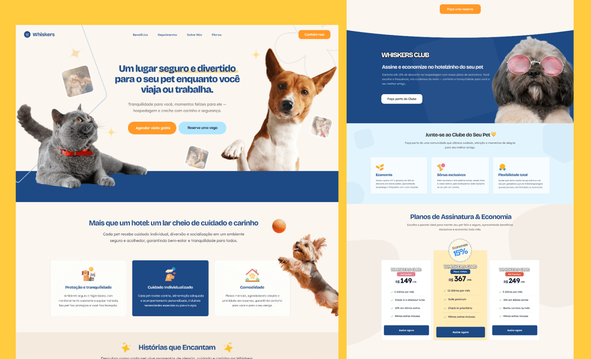

# Whiskers Pet Hotel - Landing Page



**Whiskers** é a experiência digital definitiva para o universo pet, projetada para conectar, engajar e converter. Cada elemento do site foi pensado para transformar visitantes curiosos em leads qualificados e clientes fiéis, usando design estratégico, automação inteligente e UX inspirada em dados reais.

## 💡 Proposta de Valor
- **Transformar a jornada do cliente** com UX intuitiva e responsiva
- Engajar usuários com conteúdo relevante e interativo
- **Automatizar marketing e segmentação** de leads com CRM e e-mail marketing
- **Maximizar conversão** com CTAs estratégicos e **otimização de performance (CRO)**

## 🎯 Objetivos da Landing Page
    1. Captura e qualificação de leads
    2. Conversão em serviços e planos
    3. Nutrir leads com conteúdo personalizado via automação
    4. Monitorar métricas-chave e otimizar continuamente a jornada do usuário

## 🚀 Próximos Passos
- **Desenvolvimento backend** robusto para escalabilidade e novas funcionalidades
- **Integração com CRM e ferramentas de automação** para segmentação e nurturing avançados
- **Microserviços e APIs** para integrações estratégicas e parcerias
- **Analytics em tempo real e A/B testing contínuo** para decisões rápidas e baseadas em dados

## 🔧 Tecnologias
- **Front-End**: React.js, Tailwind.css e Vite
- **Design e UX**: Foco em responsividade, conversão de leads e posicionamento estratégico

## 💻 Como rodar o projeto?
```bash
# Clonar o repositório
git clone https://github.com/ingridevv/whiskers-pet-hotel.git

# Entrar na pasta do projeto
cd whiskers-pet-hotel

# Instalar dependências
npm install

# Rodar o projeto
npm start
```

## 💛 Contribuição

Sinta-se à vontade para abrir issues ou enviar pull requests! 

## Credits
[Pet Food Icons](https://www.flaticon.com/free-icons/pet-food "Pet food icons") - Pet food icons created by Freepik - Flaticon
